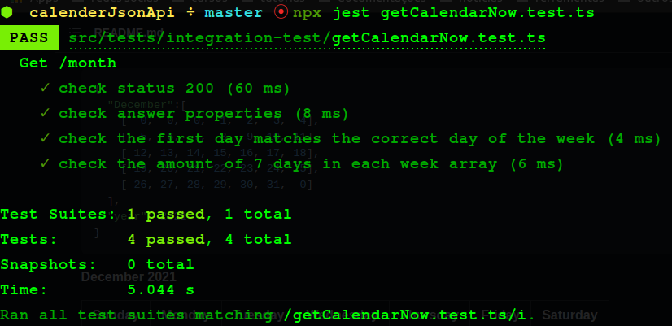
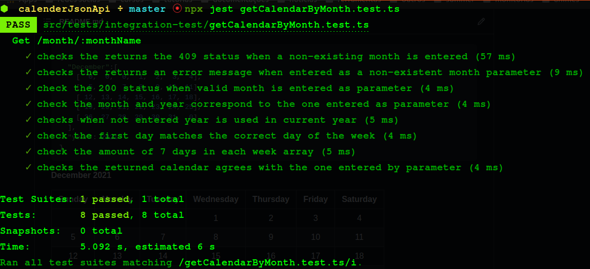
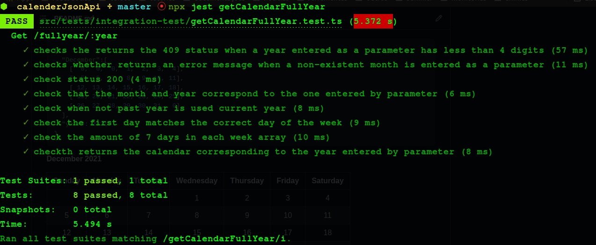

# Calendar JSON API {...} :calendar:

## Sumary

- [Introduction](#introduction)
- [Endpoints](#endpoints)
  - [Current month](#current-month)
  - [Month name](#month-name)
  - [Month name and year](#month-name-and-year)
  - [Current year](#current-year)
  - [Year](#year)
- [Technologies](#technologies)
- [Tests](#tests)
- [Deployment](#deployment)

--- 

# Introduction

The Calendar JSON API can be used to provide you with a calendar formatted as a 2D array.

For that, you may choose to query for the selected month, or the selected year, as explained in the endpoints below.

--- 

# Endpoints

## Current month

Returns the calendar of the current date.

```url
GET https://calendarjsonapi.herokuapp.com/month
```  
*E.G:*

Being the current date December 2021, the default response will be:

```json
{
  "December":[
    [  0,  0,  0,  1,  2,  3,  4],
    [  5,  6,  7,  8,  9, 10, 11],
    [ 12, 13, 14, 15, 16, 17, 18],
    [ 19, 20, 21, 22, 23, 24, 25],
    [ 26, 27, 28, 29, 30, 31,  0]
  ],
  "year": 2021
}
```

*I.E:*

**December 2021** 

| Sunday | Monday | Tuesday | Wednesday | Thursday | Friday | Saturday |
| :-----:| :-----:| :------:| :--------:| :-------:| :-----:| :-------:|
|        |        |         | 1         | 2        | 3      | 4        |
| 5      | 6      | 7       | 8         | 9        | 10     | 11       |
| 12     | 13     | 14      | 15        | 16       | 17     | 18       |
| 19     | 20     | 21      | 22        | 23       | 24     | 25       |
| 26     | 27     | 28      | 29        | 30       | 31     |          |

---

## Month name

Returns current year`s month calendar.

```url
GET https://calendarjsonapi.herokuapp.com/month/<monthName>
```  
*E.G:*

Being 2021 the current year, and November the desired month, the request must be sent as follows:

```url
GET https://calendarjsonapi.herokuapp.com/month/november
```
And the response will be:

```json
{
  "November":[
    [  0,  1,  2,  3,  4,  5,  6],
    [  7,  8,  9, 10, 11, 12, 13],
    [ 14, 15, 16, 17, 18, 19, 20],
    [ 21, 22, 23, 24, 25, 26, 27],
    [ 28, 29, 30,  0,  0,  0,  0]
    ],
  "year": 2021
}
```

*I.E:*

**November 2021** 

| Sunday | Monday | Tuesday | Wednesday | Thursday | Friday | Saturday |
| :-----:| :-----:| :------:| :--------:| :-------:| :-----:| :-------:|
|        | 1      | 2       | 3         | 4        | 5      | 6        |
| 7      | 8      | 9       | 10        | 11       | 12     | 13       |
| 14     | 15     | 16      | 17        | 18       | 19     | 20       |
| 21     | 22     | 23      | 24        | 25       | 26     | 27       |
| 28     | 29     | 30      |           |          |        |          |

---

## Month name and year

Returns the calendar for the desired month and year.

```url
GET https://calendarjsonapi.herokuapp.com/month/<monthName>?year=<yearValue>
```

*E.G:*

Desired month: October
Desired year: 2012

```url
GET https://calendarjsonapi.herokuapp.com/month/october?year=2012
```

And the response will be:

```json
{
  "October":[
    [  0,  1,  2,  3,  4,  5,  6],
    [  7,  8,  9, 10, 11, 12, 13],
    [ 14, 15, 16, 17, 18, 19, 20],
    [ 21, 22, 23, 24, 25, 26, 27],
    [ 28, 29, 30, 31,  0,  0,  0]
    ],
  "year": 2012
}
```

*I.E:*


**October 2012** 

| Sunday | Monday | Tuesday | Wednesday | Thursday | Friday | Saturday |
| :-----:| :-----:| :------:| :--------:| :-------:| :-----:| :-------:|
|        | 1      | 2       | 3         | 4        | 5      | 6        |
| 7      | 8      | 9       | 10        | 11       | 12     | 13       |
| 14     | 15     | 16      | 17        | 18       | 19     | 20       |
| 21     | 22     | 23      | 24        | 25       | 26     | 27       |
| 28     | 29     | 30      | 31        |          |        |          |

---

## Current year

Returns the complete calendar for the current year.

```url
GET https://calendarjsonapi.herokuapp.com/fullyear
```

*E.G:*

Being the current year 2021, the response will be:

```json
{
  "year":2021,
  "January":[
    [  0,  0,  0,  0,  0,  1,  2],
    [  3,  4,  5,  6,  7,  8,  9],
    [ 10, 11, 12, 13, 14, 15, 16],
    [ 17, 18, 19, 20, 21, 22, 23],
    [ 24, 25, 26, 27, 28, 29, 30],
    [ 31,  0,  0,  0,  0,  0,  0]
    ],
  "February":[
    [  0,  1,  2,  3,  4,  5,  6],
    [  7,  8,  9, 10, 11, 12, 13],
    [ 14, 15, 16, 17, 18, 19, 20],
    [ 21, 22, 23, 24, 25, 26, 27],
    [ 28,  0,  0,  0,  0,  0,  0]
    ],
  "March":[
    [  0,  1,  2,  3,  4,  5,  6],
    [  7,  8,  9, 10, 11, 12, 13],
    [ 14, 15, 16, 17, 18, 19, 20],
    [ 21, 22, 23, 24, 25, 26, 27],
    [ 28, 29, 30, 31,  0,  0,  0]
    ],
  "April":[
    [  0,  0,  0,  0,  1, 2,  3],
    [  4,  5,  6,  7,  8, 9, 10],
    [11, 12, 13, 14, 15, 16, 17], 
    [18, 19, 20, 21, 22, 23, 24], 
    [25, 26, 27, 28, 29, 30,  0]
    ],
  "May":[
    [  0,  0,  0,  0,  0,  0,  1],
    [  2,  3,  4,  5,  6,  7,  8],
    [  9, 10, 11, 12, 13, 14, 15], 
    [ 16, 17, 18, 19, 20, 21, 22], 
    [ 23, 24, 25, 26, 27, 28, 29], 
    [ 30, 31,  0,  0,  0,  0,  0]
  ],
  "June":[
    [  0,  0,  1,  2,  3,  4,  5],
    [  6,  7,  8,  9, 10, 11, 12], 
    [ 13, 14, 15, 16, 17, 18, 19], 
    [ 20, 21, 22, 23, 24, 25, 26], 
    [ 27, 28, 29, 30,  0,  0,  0]
  ],
  "July":[
    [  0,  0,  0,  0,  1,  2,  3],
    [  4,  5,  6,  7,  8,  9, 10],
    [ 11, 12, 13, 14, 15, 16, 17], 
    [ 18, 19, 20, 21, 22, 23, 24], 
    [ 25, 26, 27, 28, 29, 30, 31]
  ],
  "August":[
    [  1,  2,  3,  4,  5,  6,  7],
    [  8,  9, 10, 11, 12, 13, 14], 
    [ 15, 16, 17, 18, 19, 20, 21], 
    [ 22, 23, 24, 25, 26, 27, 28], 
    [ 29, 30, 31,  0,  0,  0,  0]
  ],
  "September":[
    [  0,  0,  0,  1,  2,  3,  4],
    [  5,  6,  7,  8,  9, 10 ,11],
    [ 12 ,13 ,14 ,15 ,16 ,17 ,18],
    [ 19 ,20 ,21 ,22 ,23 ,24 ,25],
    [ 26 ,27 ,28 ,29 ,30,  0,  0]
  ],
  "October":[
    [  0,  0,  0,  0,  0,  1,  2],
    [  3,  4,  5,  6,  7,  8,  9],
    [ 10, 11, 12, 13, 14, 15, 16], 
    [ 17, 18, 19, 20, 21, 22, 23], 
    [ 24, 25, 26, 27, 28, 29, 30],
    [ 31,  0,  0,  0,  0,  0,  0]
  ],
  "November":[
    [  0,  1,  2,  3,  4,  5,  6],
    [  7,  8,  9, 10, 11, 12, 13],
    [ 14, 15, 16, 17, 18, 19, 20],
    [ 21, 22, 23, 24, 25, 26, 27],
    [ 28, 29, 30,  0,  0,  0,  0]
  ],
  "December":[
    [  0,  0,  0,  1,  2,  3,  4],
    [  5,  6,  7,  8,  9, 10, 11],
    [ 12, 13, 14, 15, 16, 17, 18],
    [ 19, 20, 21, 22, 23, 24, 25],
    [ 26, 27, 28, 29, 30, 31,  0]
  ]
}
```
---

## Year

Returns the desired year's complete calendar.

```url
GET https://calendarjsonapi.herokuapp.com/fullyear/<year>
```

*E.G*

Entering the year 2031 as a parameter

```url
GET https://calendarjsonapi.herokuapp.com/fullyear/2031
```
the response will be:

```json
{
  "year": 2031,
  "January":[
    [  0,  0,  0,  1,  2,  3,  4],
    [  5,  6,  7,  8,  9, 10, 11],
    [ 12, 13, 14, 15, 16, 17, 18],
    [ 19, 20, 21, 22, 23, 24, 25],
    [ 26, 27, 28, 29, 30, 31,  0]
    ],
    "February":[
    [  0,  0,  0,  0,  0,  0,  1],
    [  2,  3,  4,  5,  6,  7,  8],
    [  9, 10, 11, 12, 13, 14, 15],
    [ 16, 17, 18, 19, 20, 21, 22],
    [ 23, 24, 25, 26, 27, 28,  0],
    [  0,  0,  0,  0,  0,  0,  0]
    ],
    "March":[
    [  0,  0,  0,  0,  0,  0,  1],
    [  2,  3,  4,  5,  6,  7,  8],
    [  9, 10, 11, 12, 13, 14, 15],
    [ 16, 17, 18, 19, 20, 21, 22],
    [ 23, 24, 25, 26, 27, 28, 29],
    [ 30, 31,  0,  0,  0,  0,  0]
    ],
    "April":[
    [  0,  0,  1,  2,  3,  4,  5],
    [  6,  7,  8,  9, 10, 11, 12],
    [ 13, 14, 15, 16, 17, 18, 19],
    [ 20, 21, 22, 23, 24, 25, 26],
    [ 27, 28, 29, 30,  0,  0,  0]
    ],
    "May":[
    [  0,  0,  0,  0,  1,  2,  3],
    [  4,  5,  6,  7,  8,  9, 10],
    [ 11, 12, 13, 14, 15, 16, 17],
    [ 18, 19, 20, 21, 22, 23, 24],
    [ 25, 26, 27, 28, 29, 30, 31]
    ],
    "June":[
    [  1,  2,  3,  4,  5,  6,  7],
    [  8,  9, 10, 11, 12, 13, 14],
    [ 15, 16, 17, 18, 19, 20, 21],
    [ 22, 23, 24, 25, 26, 27, 28],
    [ 29, 30,  0,  0,  0,  0,  0]
    ],
    "July":[
    [  0,  0,  1,  2,  3,  4,  5],
    [  6,  7,  8,  9, 10, 11, 12],
    [ 13, 14, 15, 16, 17, 18, 19],
    [ 20, 21, 22, 23, 24, 25, 26],
    [ 27, 28, 29, 30 ,31,  0,  0]
    ],
    "August":[
    [  0,  0,  0,  0,  0,  1,  2],
    [  3,  4,  5,  6,  7,  8,  9],
    [ 10, 11, 12, 13, 14, 15, 16],
    [ 17, 18, 19, 20, 21, 22, 23],
    [ 24, 25, 26, 27, 28, 29, 30],
    [ 31,  0,  0,  0,  0,  0,  0]
    ],
    "September":[
    [  0,  1,  2,  3,  4,  5,  6],
    [  7,  8,  9, 10, 11, 12, 13],
    [ 14, 15, 16, 17, 18, 19, 20],
    [ 21, 22, 23, 24, 25, 26, 27],
    [ 28, 29, 30,  0,  0,  0,  0]
    ],
    "October":[
    [  0,  0,  0,  1,  2,  3,  4],
    [  5,  6,  7,  8,  9, 10, 11],
    [ 12, 13, 14, 15, 16, 17, 18],
    [ 19, 20, 21, 22, 23, 24, 25],
    [ 26, 27, 28, 29, 30, 31,  0]
    ],
    "November":[
    [  0,  0,  0,  0,  0,  0,  1],
    [  2,  3,  4,  5,  6,  7,  8],
    [  9, 10, 11, 12, 13, 14, 15],
    [ 16, 17, 18, 19, 20, 21, 22],
    [ 23, 24, 25, 26, 27, 28, 29],
    [ 30,  0,  0,  0,  0,  0,  0]
    ],
    "December":[
    [  0,  1,  2,  3,  4,  5,  6],
    [  7,  8,  9, 10, 11, 12, 13],
    [ 14, 15, 16, 17, 18, 19, 20],
    [ 21, 22, 23, 24, 25, 26, 27],
    [ 28, 29, 30, 31,  0,  0,  0]
  ]
}
```
---

# Technologies

- Typescript
- Express
- Jest
- Ts node dev
- Super test
- Dotenv
- Http status code
- Eslint

<div align="center">
  
  &nbsp;&nbsp;&nbsp;
  
  &nbsp;&nbsp;&nbsp;
  
  &nbsp;&nbsp;&nbsp;
  
  &nbsp;&nbsp;&nbsp;
  
  &nbsp;&nbsp;&nbsp;
</div>

---

# Tests

Developed integration tests, using jest and supertest, for all endpoints





--- 

# Deployment

Deployment on [Heroku](GET https://www.heroku.com/)

 
